<h1 align="center">QR-Master</h1>

<p align="center">
  <strong>Pełnostackowa platforma SaaS do generowania, zarządzania i analizy kodów QR</strong><br>
  Zbudowana na Laravel 13, Vue 3, TypeScript i nowoczesnym stosie chmurowym
</p>

<p align="center">
  
  
  
  
  
  
  
  
  
  
</p>

<br>

<p align="center">
  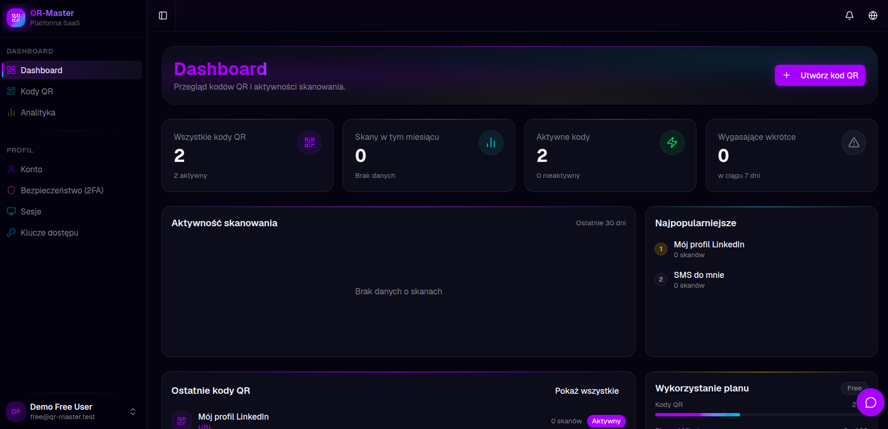
</p>

---

## Spis treści

- [O projekcie](#o-projekcie)
- [Plany subskrypcji](#plany-subskrypcji)
- [Sztuczna inteligencja](#sztuczna-inteligencja)
- [Zrzuty ekranu](#zrzuty-ekranu)
- [Funkcjonalności](#funkcjonalności)
- [Stos technologiczny](#stos-technologiczny)
- [Architektura](#architektura)
- [Uruchomienie lokalne](#uruchomienie-lokalne)
- [Testowanie](#testowanie)
- [Licencja](#licencja)

---

## O projekcie

QR-Master to gotowa produkcyjnie platforma SaaS, która obsługuje **pełny cykl życia kodów QR** — od momentu ich wygenerowania i zaprojektowania wizualnego, przez inteligentne przekierowania i testy A/B, aż po szczegółową analitykę w czasie rzeczywistym i zarządzanie zespołami na poziomie enterprise. Platforma integruje **sztuczną inteligencję** jako pełnoprawną warstwę produktu: AI wspiera użytkownika na każdym etapie pracy — od doboru kolorystyki i generowania treści, przez kontekstową analizę wydajności kampanii, po wykrywanie anomalii i wyszukiwanie semantyczne oparte na embeddingach wektorowych.

Projekt powstał jako portfolio showcase, demonstrując zaawansowane umiejętności inżynierskie w obszarze architektury aplikacji, integracji AI, bezpieczeństwa, wydajności i nowoczesnego UX. Każda warstwa aplikacji odzwierciedla podejście właściwe dla komercyjnego produktu SaaS: od analizy statycznej PHPStan poziomu 8, przez typowane DTO na wszystkich granicach systemu, po wieloproviderową abstrakcję modeli językowych (DeepSeek, Anthropic Claude, OpenAI, Gemini), zgodność z RODO i szyfrowanie danych wrażliwych w spoczynku.

**Skala i zasięg projektu:**
- **50+ stron frontendowych** zbudowanych w Vue 3 + TypeScript + Inertia.js
- **242 pliki PHP** — Actions, Services, Jobs, Models, Policies, Middleware
- **13 ukończonych etapów** deweloperskich według zaplanowanego roadmapu
- **13 typów kodów QR** — URL, vCard, WiFi, SMS, E-mail, Telefon, Geo, PDF, Bio-Link, Kalendarz, Krypto, App, Recenzja
- **REST API** z autoryzacją tokenami Sanctum i specyfikacją OpenAPI

**Model biznesowy i monetyzacja:**

Platforma działa w modelu freemium z czterema planami subskrypcji rozliczanymi przez Stripe. Użytkownicy mogą zacząć bezpłatnie, a w miarę rosnących potrzeb (więcej kodów QR, zaawansowana analityka, AI, własne domeny, zarządzanie zespołem) przejść na wyższy plan — jednym kliknięciem, bez utraty danych. Każdy nowy użytkownik automatycznie otrzymuje **14-dniowy trial Pro**, by bez ryzyka przetestować pełne możliwości platformy.

**Integracja ze sztuczną inteligencją:**

AI jest wbudowane w rdzeń produktu, nie jest dodatkiem. Przez abstrakcję wieloproviderową (Prism) aplikacja komunikuje się z DeepSeek, Anthropic Claude, OpenAI lub Gemini — bez żadnej zmiany kodu aplikacji. Funkcje AI obejmują sugestię palet kolorystycznych po wgraniu logo, automatyczne generowanie nazw kampanii i CTA, analizę wydajności w języku naturalnym, wykrywanie anomalii (fraud/bot detection) oraz wyszukiwanie semantyczne kodów QR oparte na embeddingach pgvector.

---

## Plany subskrypcji

| Plan | Cena | Kody QR | Skanowania/mies. | AI zapytania/mies. | Kluczowe funkcje |
|---|---|---|---|---|---|
| **Free** | 0 PLN | 5 | 500 | — | Podstawowe typy QR, PNG/SVG export |
| **Pro** | 49 PLN/mies. | 100 | 50 000 | 50 | Analityka, smart redirect, A/B testy, własne logo, trial 14 dni |
| **Business** | 199 PLN/mies. | Bez limitu | 500 000 | 500 | Własne domeny, webhooki, API, zarządzanie zespołem, white-label |
| **Enterprise** | Wycena indywidualna | Bez limitu | Bez limitu | Bez limitu | SSO/SAML, SCIM, IP allowlist, rezydencja danych, DPA, SLA |

Wszystkie plany płatne obsługują przełącznik **miesięczny / roczny** (oszczędność ~20% przy rocznej rozgrywce), automatyczne naliczanie podatku VAT z pobieraniem NIP przy kasie oraz kody promocyjne. Płatność realizowana jest przez **Stripe Checkout** — hostowaną, certyfikowaną stronę płatności zgodną z PCI DSS. Każda subskrypcja jest w pełni zarządzana: można ją anulować, zmienić plan lub pobrać faktury bezpośrednio z panelu użytkownika — bez kontaktu z supportem.

---

## Sztuczna inteligencja

QR-Master integruje AI jako wbudowaną warstwę produktu, dostępną we wszystkich kluczowych przepływach pracy:

### Abstrakcja wieloproviderowa (Prism)

Cała logika AI przechodzi przez bibliotekę [Prism](https://prism.echolabs.dev/), która ujednolica interfejs do różnych dostawców modeli językowych. Dzięki temu możliwa jest podmiana providera (DeepSeek ↔ Anthropic Claude ↔ OpenAI ↔ Gemini ↔ Ollama) wyłącznie przez zmianę konfiguracji — bez modyfikacji kodu aplikacji. Pozwala to na optymalizację kosztów i elastyczne reagowanie na zmiany w ofercie dostawców.

### Funkcje AI dostępne w produkcie

| Funkcja | Opis | Dostępność |
|---|---|---|
| **Sugestia palet kolorów** | Wgraj logo — AI analizuje kolory i proponuje 5 harmonijnych palet dla QR | Pro+ |
| **Generowanie nazwy kampanii** | Wklej URL, otrzymaj zwięzłe, chwytliwe nazwy do szybkiego oznaczenia kodu | Pro+ |
| **Generowanie CTA** | 5 fraz call-to-action dopasowanych do treści i kontekstu kodu QR | Pro+ |
| **Treść Bio-Link** | Automatyczne wygenerowanie tekstu bio i tytułów linków dla strony docelowej | Pro+ |
| **Insights wydajności** | Naturalna analiza statystyk skanowania — trendy, wnioski, rekomendacje | Pro+ |
| **Wykrywanie anomalii** | Analiza wzorców bot/fraud na podstawie skanowań z poziomem pewności | Business+ |
| **Wyszukiwanie semantyczne** | Szukaj kodów QR po znaczeniu (pgvector 768-dim, Gemini embeddings) | Business+ |

### Limity i model rozliczeniowy AI

Zapytania AI są mierzone per plan (rate limiting przez middleware `EnsureAiRateLimit`) i naliczane w czasie rzeczywistym: Free — brak dostępu, Pro — 50 zapytań/mies., Business — 500/mies., Enterprise — bez limitu. Użytkownik widzi bieżące zużycie w widgecie planu na dashboardzie.

---

## Zrzuty ekranu

### Panel główny (Dashboard)

<p align="center">
  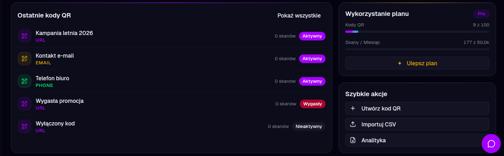
</p>

Dashboard to centralny punkt aplikacji: widać tu ostatnio utworzone kody QR, widget bieżącego zużycia planu (liczba kodów, skanowania, zapytania AI), szybkie akcje (utwórz nowy kod, przejdź do analityki) oraz powiadomienia systemowe. Liczniki użycia aktualizują się w czasie rzeczywistym przez WebSocket (Laravel Reverb), dzięki czemu użytkownik zawsze wie, ile zasobów planu pozostało.

---

### Lista kodów QR

<p align="center">
  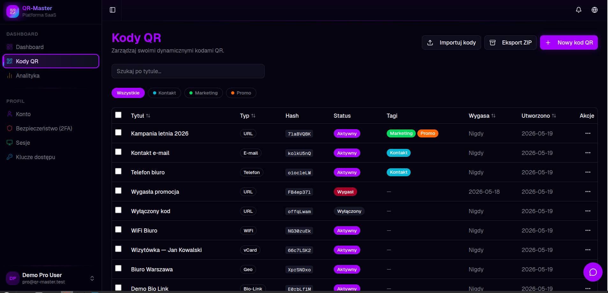
</p>

Widok listy oparty na TanStack Table v5 oferuje sortowanie, filtrowanie po typie/statusie/tagu oraz akcje zbiorcze (dezaktywuj, eksportuj, usuń zaznaczone). Każdy wiersz pokazuje miniaturę kodu, typ, cel, liczbę skanów i status (aktywny / wygasły / limit wyczerpany). Filtry i stan paginacji zapisywane są w URL — linkiem można podzielić się z członkiem zespołu.

---

### Tworzenie kodu QR

<p align="center">
  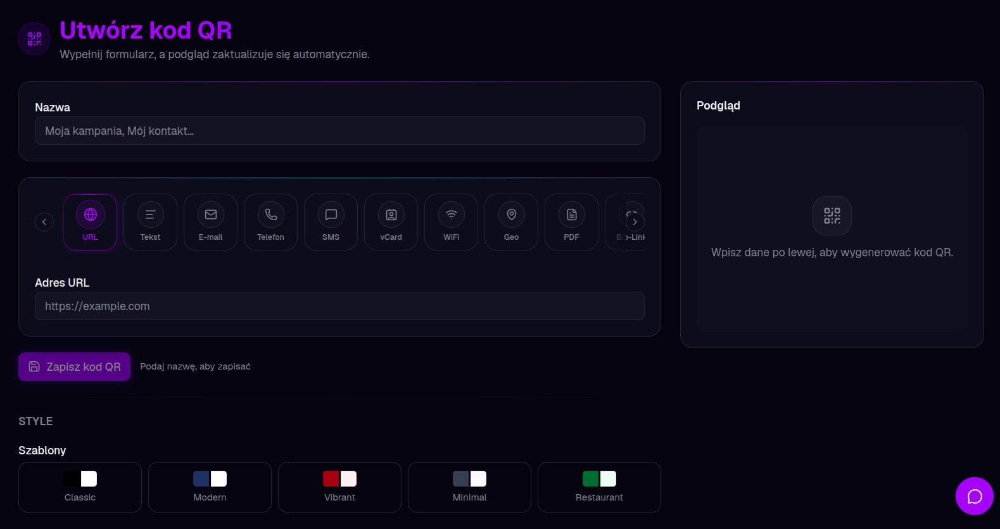
</p>

Kreator przeprowadza użytkownika przez wybór jednego z 13 typów kodu QR. Każdy typ ma dedykowany formularz z odpowiednią walidacją: URL (z weryfikacją schematu whitelist), vCard (pola PII szyfrowane w bazie), WiFi (SSID, hasło, typ zabezpieczenia), Geo (mapa z pineską), Bio-Link (edytor linków z sugestią AI) i inne. Podgląd kodu aktualizuje się live podczas wpisywania.

---

### Projektant wizualny QR

<p align="center">
  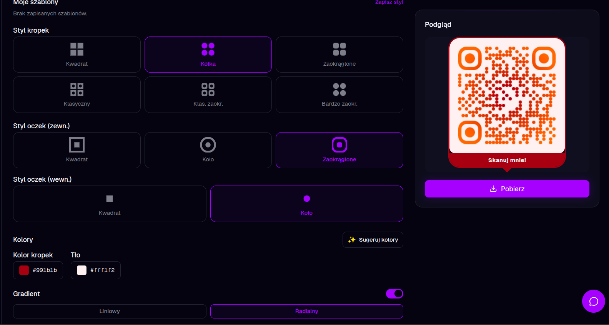
</p>

Zaawansowany edytor stylu kodu QR zbudowany na bibliotece `qr-code-styling`. Użytkownik kontroluje styl modułów (klasyczny, okrągły, bardzo zaokrąglony, pikselowy), styl narożników, kolory lub gradienty (liniowy/radialny), tło oraz logo wgrane z dysku. Przycisk **"Sugestia AI"** analizuje wgrany logotyp i generuje 5 palet kolorystycznych — gotowych do zastosowania jednym kliknięciem. Wszystkie zmiany widoczne są natychmiastowo w canvasie podglądu.

---

### Edytor kodu QR

<p align="center">
  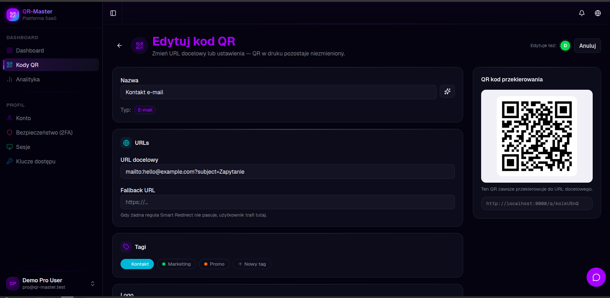
</p>

Edytor pozwala zmienić treść dynamicznego kodu QR bez potrzeby drukowania od nowa. Widoczny jest podgląd QR na żywo, pole fallback URL (domyślny cel gdy żadna reguła smart redirect nie pasuje), zarządzanie tagami, ustawienia ochrony hasłem oraz limit skanów z datą wygaśnięcia. Formularz korzysta z dedykowanego `FormRequest` i Spatie Laravel Data DTO — żadne dane nie trafiają do akcji bez pełnej walidacji.

---

### Analityka

<p align="center">
  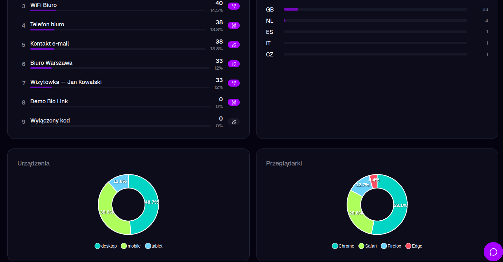
</p>

Panel analityki pokazuje timeline skanowań (ApexCharts, zakres dat konfigurowalny), breakdown krajów (wykres słupkowy z flagami), podział na typy urządzeń (desktop / mobile / tablet) i przeglądarki (wykresy pierścieniowe). Dane agregowane są z miesięcznych partycji PostgreSQL, co zapewnia wydajność nawet przy milionach wierszy. Adresy IP nigdy nie są przechowywane — zamiast nich zapisywany jest jednorazowy hash HMAC-SHA256, spełniając wymogi RODO bez utraty wartości analitycznej.

---

### Asystent AI

<p align="center">
  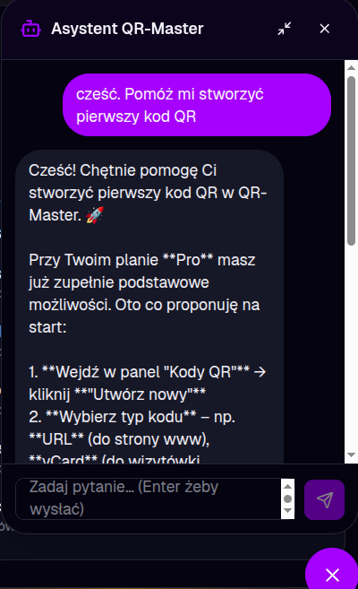
</p>

Kontekstowy asystent AI dostępny z dowolnego miejsca w aplikacji. Zna aktualnie przeglądany kod QR, jego statystyki i konfigurację, co pozwala zadawać konkretne pytania: "Dlaczego ten kod ma mało skanowań?", "Napisz tekst CTA do tej kampanii", "Jakie trendy widzisz w skanowaniach z ostatnich 30 dni?". Pod spodem działa wieloproviderowa abstrakcja Prism — aktywny model AI wybierany jest przez konfigurację środowiska.

---

### Cennik i plany

<p align="center">
  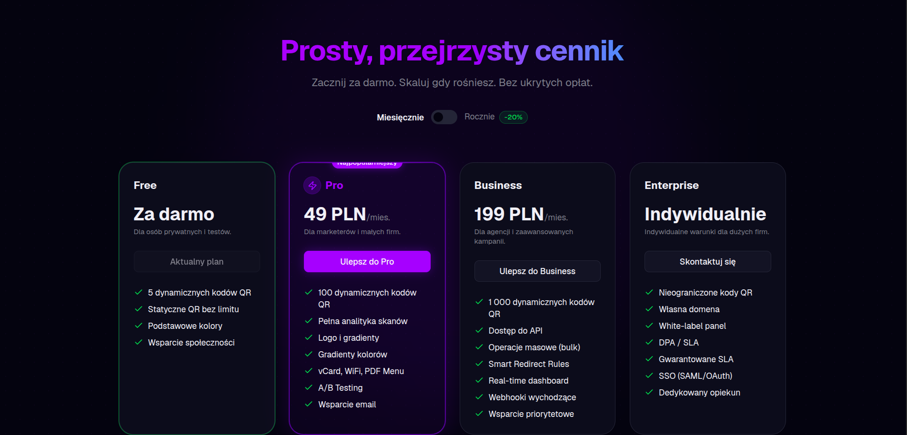
</p>

Strona cennika zawiera przełącznik miesięczny/roczny (oszczędność ~20% przy rocznym rozliczeniu), karty planów z wyróżnionym planem Business jako rekomendowanym oraz szczegółową tabelę porównawczą wszystkich funkcji. Kliknięcie "Kup teraz" lub "Zacznij trial" kieruje bezpośrednio na Stripe Checkout. Użytkownicy zalogowani widzą swój bieżący plan wyróżniony — bez możliwości ponownego zakupu tego samego planu.

---

### Eksport kodu QR

<p align="center">
  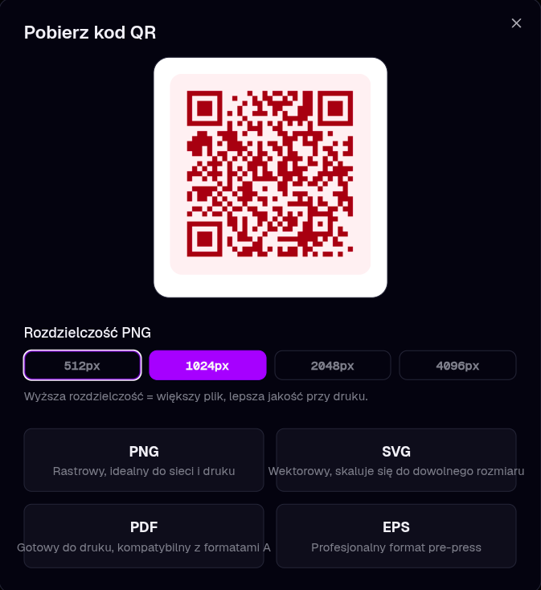
</p>

Modal eksportu udostępnia cztery formaty wyjściowe: PNG (wybór rozdzielczości 512 px – 4096 px, gotowy na duże wydruki), SVG (w pełni wektorowy, skalowalny bez utraty jakości), PDF (bezpośrednio do druku) oraz EPS (profesjonalny format pre-press do agencji poligraficznych). Eksport SVG i EPS dostępny jest od planu Pro.

---

### Stripe Checkout

<p align="center">
  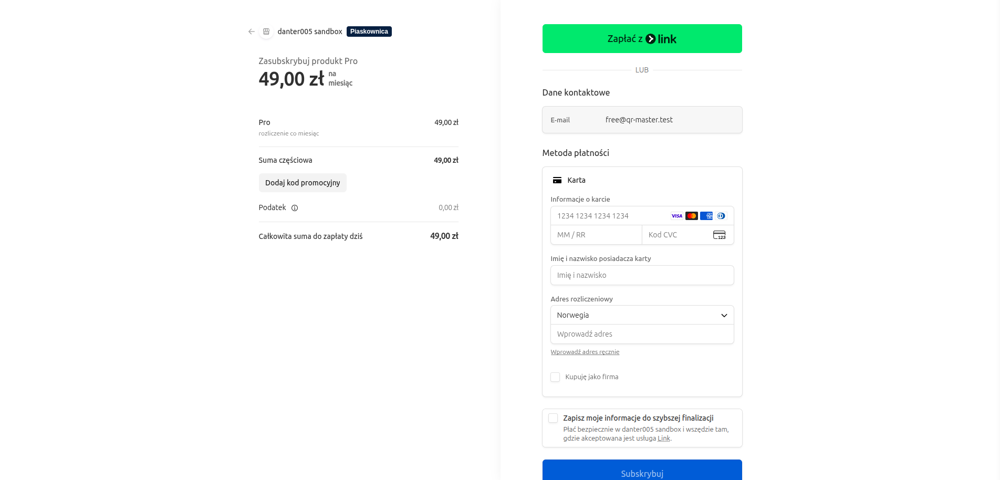
</p>

Płatność odbywa się na hostowanej stronie Stripe Checkout — certyfikowanej zgodnie z PCI DSS, obsługującej karty, Apple Pay, Google Pay i przelewy lokalne. Przy kasie pobierany jest NIP/VAT dla firm (Stripe Tax oblicza stawkę automatycznie na podstawie kraju). Pole kodu promocyjnego pozwala zastosować rabat przed finalizacją. Po udanej płatności użytkownik wraca do aplikacji, a jego plan aktywowany jest natychmiastowo przez webhook Stripe.

---

## Funkcjonalności

### Generowanie kodów QR
- **13 typów QR** — URL, Tekst, E-mail, Telefon, SMS, WiFi, vCard, Geo, App, Bio-Link, PDF Menu, Wydarzenie kalendarzowe, Płatność krypto, Link do recenzji
- **Podgląd na żywo** oparty na `qr-code-styling` — aktualizuje się w czasie rzeczywistym podczas wpisywania
- **Projektant wizualny** — style kropek (okrągłe, klasyczne, bardzo zaokrąglone), style narożników, gradienty, upload własnego logo
- **Szablony stylów** — Classic, Modern, Vibrant, Minimal, Restaurant i inne; możliwość zapisu własnych
- **Eksport** — PNG (512px–4096px), SVG (wektorowy), PDF, EPS (profesjonalny pre-press)
- **Import zbiorczy** przez CSV z przetwarzaniem w tle i broadcastem postępu w czasie rzeczywistym
- **AI sugestie kolorów** — wgraj logo, otrzymaj 5 harmonijnych palet kolorystycznych wygenerowanych przez AI

### Inteligentne przekierowania i testy A/B
- **Dynamiczne kody QR** — zmień URL docelowy w dowolnym momencie bez potrzeby drukowania od nowa
- **Reguły smart redirect** — kieruj skany na podstawie urządzenia (iOS/Android/Desktop), kraju, pory dnia lub języka
- **Testy A/B** — twórz ważone warianty i śledź konwersje na każdy wariant
- **Ochrona hasłem** — bramkuj dostęp do kodu QR za pomocą hasła z odblokowaną sesją
- **Limit skanów** — automatyczna dezaktywacja kodu po N skanach (atomowy inkrement w bazie)
- **Geofencing** — lista dozwolonych krajów; przekieruj zablokowanych odwiedzających na własną stronę
- **Harmonogram aktywacji** — ustaw datę startu i końca aktywności kodu QR
- **Fallback URL** — definiuj domyślny cel, gdy żadna reguła nie pasuje

### Analityka i raporty
- **Licznik skanów w czasie rzeczywistym** przez Laravel Reverb (WebSockets)
- **Szczegółowy breakdown skanów** — kraj, miasto, typ urządzenia (desktop/mobile/tablet), system operacyjny, przeglądarka
- **Wykresy** — oś czasu skanów, wykresy pierścieniowe urządzeń i przeglądarek, wykres słupkowy krajów
- **Ranking najpopularniejszych kodów** w całym koncie
- **Eksport raportu PDF** — wygeneruj brandowany raport analityczny dla dowolnego kodu QR
- **Porównanie wielu kodów** — analityka side-by-side
- **Partycjonowanie logów skanów** — miesięczne partycje PostgreSQL utrzymują analitykę sprawną w dużej skali
- **Zgodność z RODO** — surowe adresy IP nigdy nie są zapisywane; przechowywany jest wyłącznie hash HMAC-SHA256

### Płatności i subskrypcje
- **Stripe Checkout** przez Laravel Cashier — hostowana strona płatności zgodna z PCI
- **4 plany subskrypcji** — Free, Pro (49 PLN/mies.), Business (199 PLN/mies.), Enterprise (wycena indywidualna)
- **Automatyczny podatek** — Stripe Tax z pobieraniem NIP/VAT przy kasie
- **Kody promocyjne** — obsługa rabatów do zrealizowania przy checkout
- **14-dniowy trial Pro** przy rejestracji
- **Bramki funkcji per plan** — middleware egzekwuje dostęp do funkcji na poziomie całej aplikacji
- **Program partnerski** — śledzenie prowizji 20% dla partnerów polecających
- **Metering użycia** — śledzenie w czasie rzeczywistym liczby stworzonych kodów i zużytych skanów

### Bezpieczeństwo i zgodność z RODO
- **Uwierzytelnianie dwuskładnikowe** (TOTP via Laravel Fortify) + **Klucze dostępu / WebAuthn** (FIDO2, laragear/webauthn)
- **Szyfrowanie danych wrażliwych w spoczynku** — hasła WiFi i pola PII vCard szyfrowane castem `'encrypted'`
- **Argon2id** do hashowania haseł
- **Content Security Policy** z nonce, HSTS preload, X-Frame-Options DENY (spatie/laravel-csp)
- **Cloudflare Turnstile** ochrona botów na formularzach auth
- **Rate limiting** — 60 req/min per IP na publicznym przekierowaniu QR, limity API per plan (60/1000/10000/h)
- **Allowlista IP** per workspace (Enterprise)
- **RODO/GDPR** — eksport danych, prawo do usunięcia (`purgeUserData()`), automatyczna anonimizacja logów skanów po 90 dniach
- **Audit log** — każda wrażliwa operacja logowana asynchronicznie z aktorem, podmiotem, hashem IP i metadanymi
- **Filtr PII w Sentry** — `beforeSend` usuwa e-mail, IP i telefon przed wysłaniem do trackera błędów

### Enterprise i Multi-Tenancy
- **Zespoły / Workspace'y** — zapraszaj członków, przypisuj role (Właściciel, Admin, Członek), przełączaj kontekst
- **White-label branding** — własne logo, kolory i domena per workspace
- **Własne domeny** — brandowane krótkie linki (np. `qr.twojamarke.pl/abc123`)
- **SSO / SAML** — konfiguracja logowania jednokrotnego per workspace
- **SCIM auto-provisioning** — synchronizacja użytkowników z dostawcy tożsamości
- **Generator DPA** — wypełnij dane firmy, pobierz podpisaną Umowę Powierzenia Przetwarzania Danych
- **Rezydencja danych** — wybór regionu przechowywania danych (EU / US) per workspace
- **Webhooki wychodzące** — subskrypcja na zdarzenia (skan, tworzenie, aktualizacja) z podpisanymi payloadami HMAC i ponowieniami wykładniczymi
- **REST API** — autoryzacja tokenami Sanctum z granularnymi ability scopes, spec OpenAPI pod `/api/openapi.json`
- **PWA** — instalowalna aplikacja, zapisywanie szkiców offline, powiadomienia Web Push

---

## Stos technologiczny

### Backend
| | |
|---|---|
| **Framework** | Laravel 13 + FrankenPHP + Laravel Octane |
| **Język** | PHP 8.3 (strict_types, readonly properties, backed enums) |
| **Baza danych** | PostgreSQL 17 (JSONB, pgvector, partycje miesięczne) |
| **Cache / Kolejka** | Redis 7 · Laravel Horizon (monitoring zadań) |
| **WebSockets** | Laravel Reverb (self-hosted, natywny broadcasting Laravel) |
| **Wyszukiwanie** | Laravel Scout + Typesense |
| **Uwierzytelnianie** | Laravel Fortify (2FA TOTP) + Laragear WebAuthn + Laravel Socialite |
| **Płatności** | Laravel Cashier + Stripe |
| **Silnik QR** | chillerlan/php-qrcode ^6.0 |
| **AI** | Prism (multi-provider: DeepSeek, Anthropic, OpenAI, Gemini) |
| **Media** | Spatie Media Library (loga, PDF, miniatury) |
| **Panel admina** | Filament v5 (pod `/admin`) |
| **Monitoring** | Sentry (filtr PII) + Laravel Telescope (dev/staging) |

### Frontend
| | |
|---|---|
| **Most SPA** | Inertia.js 3 (Vue bez oddzielnego API) |
| **Framework** | Vue 3 (Composition API, `<script setup lang="ts">`) |
| **Typy** | TypeScript strict + vue-tsc |
| **Stylowanie** | Tailwind CSS 4 (design tokeny `@theme inline`) |
| **Komponenty** | shadcn-vue + Reka UI |
| **Build** | Vite 6 |
| **Dane** | TanStack Query v5 + TanStack Table v5 |
| **Wykresy** | ApexCharts |
| **Animacje** | Motion-v + Lottie Web |
| **Podgląd QR** | qr-code-styling ^1.9.2 (canvas, live preview) |
| **Tłumaczenia** | vue-i18n (PL + EN, zero hardkodowanych stringów) |

### Infrastruktura i jakość kodu
| | |
|---|---|
| **Hosting** | Laravel Cloud / Forge + VPS |
| **Storage** | Cloudflare R2 (kompatybilny z S3) |
| **CDN / Bezpieczeństwo** | Cloudflare DNS + WAF + Turnstile |
| **CI/CD** | GitHub Actions (lint, testy, PHPStan, security audit, build, deploy) |
| **Analiza statyczna** | PHPStan poziom 8 + Larastan |
| **Styl kodu** | Laravel Pint (PSR-12) |
| **Bezpieczeństwo zależności** | Snyk + Dependabot + `composer audit` + `npm audit` |
| **Git Hooks** | Lefthook (pre-commit: Pint + ESLint; pre-push: PHPStan + Pest smoke) |

---

## Architektura

Backend stosuje wzorzec **Action + Service + DTO** (Spatie style) dla maksymalnej czytelności i testowalności:

```
app/
├── Actions/          # Klasy jednego use-case — CreateQrCodeAction, SuggestPaletteAction…
│   ├── QrCode/       # 19 akcji QR, w tym 7 wspieranych przez AI
│   ├── BioLink/      # 6 akcji zarządzania Bio-Link
│   ├── Team/         # 8 akcji workspace/team
│   └── Billing/      # Zarządzanie triałem i subskrypcją
├── Data/             # Spatie Laravel Data DTO — typowane granice między warstwami
├── Services/         # Wielokrotnego użytku logika domenowa — QrRenderer, AiService, AbTestService…
├── Models/           # Cienkie modele Eloquent — relacje, casty, scope'y
├── Http/
│   ├── Controllers/  # Cienkie: validate → Action → response. Zero logiki biznesowej.
│   ├── Requests/     # FormRequest dla każdego inputu
│   └── Middleware/   # EnsurePlanFeature, EnsureAiRateLimit, EnforceIpAllowlist…
├── Jobs/             # Workery async — RecordScanJob, DeliverWebhookJob, IndexQrCodeEmbeddingJob…
├── Policies/         # Laravel Gates/Policies dla każdego modelu
├── Enums/            # Backed PHP 8.3 enums — QrCodeType, PlanTier, DotStyle…
└── Support/          # Value objects, helpery — HashGenerator, GeoLookupService…
```

**Kluczowe decyzje projektowe:**
- Kontrolery są celowo cienkie — walidują input i wywołują jedną Akcję, nic więcej
- Każdy przepływ danych przez granicę systemu używa typowanych DTO — żadnych `array` w publicznych sygnaturach
- Każda operacja asynchroniczna (logowanie skanów, dostarczanie webhooków, embeddingi AI) jest przesyłana do kolejkowanych Jobów
- Dostęp do funkcji jest egzekwowany w middleware, a nie rozrzucony po kontrolerach

---

## Uruchomienie lokalne

### Wymagania

- PHP 8.3+
- Node.js 20+
- PostgreSQL 17
- Redis 7
- Composer 2

### Instalacja

```bash
# 1. Sklonuj repozytorium
git clone https://github.com/daniel-ciupek/QR-Master.git
cd QR-Master

# 2. Zainstaluj zależności
composer install
npm install

# 3. Konfiguracja środowiska
cp .env.example .env
php artisan key:generate

# 4. Uzupełnij .env
# — DB_DATABASE, DB_USERNAME, DB_PASSWORD (PostgreSQL)
# — STRIPE_KEY, STRIPE_SECRET, STRIPE_PRICE_PRO, STRIPE_PRICE_BUSINESS
# — DEEPSEEK_API_KEY (lub ANTHROPIC_API_KEY / OPENAI_API_KEY dla AI)
# — SCAN_IP_HASH_SALT (losowy string 64 znaki)

# 5. Migracja i seedowanie bazy
php artisan migrate --seed

# 6. Build frontendu
npm run build
```

### Uruchamianie

```bash
# Wszystkie usługi naraz (Octane + Vite + Horizon + Reverb)
composer run dev
```

Lub każda usługa osobno:

```bash
php artisan octane:start --watch   # Laravel + FrankenPHP
npm run dev                         # Vite HMR
php artisan horizon                 # Workery kolejkowe
php artisan reverb:start            # Serwer WebSocket
```

### Docker

```bash
docker compose up -d
docker compose exec app php artisan migrate --seed
```

Aplikacja dostępna pod **http://localhost:8000**

Konta demo (po seedowaniu):
| E-mail | Hasło | Plan |
|---|---|---|
| `free@qr-master.test` | `password` | Free |
| `pro@qr-master.test` | `password` | Pro |
| `business@qr-master.test` | `password` | Business |

---

## Testowanie

```bash
# PHP — Pest (równoległy, min. 80% pokrycia)
php artisan test --parallel --coverage --min=80

# Analiza statyczna — PHPStan poziom 8
./vendor/bin/phpstan analyse

# Styl kodu
./vendor/bin/pint --test

# Frontend — Vitest
npm run test

# Sprawdzanie typów
npm run typecheck

# E2E — Playwright (wymagane przed merge do main)
npm run test:e2e
```

Potok CI/CD uruchamia pełną suitę przy każdym pull requeście przez GitHub Actions: PHP lint → PHPStan → Pest → JS lint → vue-tsc → Vitest → Playwright smoke → security audit → build.

---

## Licencja

Projekt jest oprogramowaniem open-source dostępnym na [licencji MIT](https://opensource.org/licenses/MIT).
